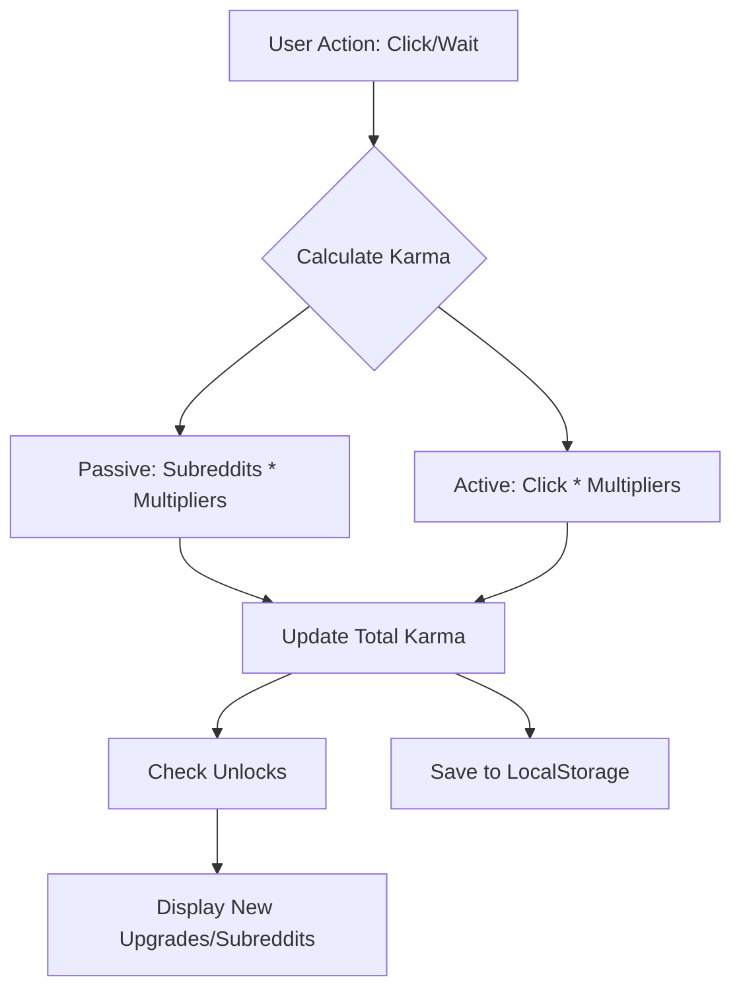

# Karma Tycoon: Technical Specification & MVP Plan

## 1. Overview
Karma Tycoon is an incremental (idle) game where players grow a network of subreddits to earn "Karma". The goal is to reach the front page of the internet and dominate the karma leaderboards.

## 2. Technical Stack
- **Framework**: [`Next.js 14+ (App Router)`](https://nextjs.org)
- **Styling**: [`Tailwind CSS`](https://tailwindcss.com) + [`shadcn/ui`](https://ui.shadcn.com)
- **State Management**: [`Zustand`](https://github.com/pmndrs/zustand) (with persist middleware)
- **Animations**: [`Framer Motion`](https://www.framer.com/motion/)
- **Icons**: [`Lucide React`](https://lucide.dev)

## 3. Core Data Structures

### GameState (Zustand)
```typescript
interface Subreddit {
  id: string;
  name: string;
  subscribers: number;
  karmaPerSecond: number;
  level: number;
  baseCost: number;
  multiplier: number;
  unlocked: boolean;
}

interface GameStore {
  totalKarma: number;
  lifetimeKarma: number;
  subreddits: Subreddit[];
  upgrades: GlobalUpgrade[];
  activeEvents: ViralEvent[];
  lastTick: number; // for offline progress
}
```

## 4. MVP Mechanics
1.  **Passive Income**: Every subreddit generates `karmaPerSecond`.
2.  **Active Clicking**: Clicking the "Create Content" button grants karma based on current `karmaPerClick` (scaled by total subscribers).
3.  **Upgrades**:
    - **Automod**: Increases karma generation by 10%.
    - **Influencer Partnership**: Increases subscriber growth rate.
    - **Meme Factory**: Multiplies karma from clicks.
4.  **Events**: Random "Viral" events that boost specific subreddit categories for 60 seconds.

## 5. UI/UX Architecture
- **Navigation**: Sidebar or Bottom Bar (Mobile) for switching between "Dashboard", "Subreddits", "Upgrades", and "Stats".
- **Dashboard**: Central hub showing total Karma and a "Click to Post" button with visual feedback (floating +1s).
- **Subreddit Grid**: Cards representing each subreddit with progress bars for the next "level up".
- **Real-time Updates**: Use a `requestAnimationFrame` or `setInterval` hook to update karma totals at 60fps for smoothness.

## 6. Implementation Phases

### Phase 1: Foundation [DONE]
- Scaffold Next.js app.
- Setup Tailwind and shadcn/ui.
- Create the basic Zustand store with `persist` middleware.

### Phase 2: Core Loop [DONE]
- Implement the "Post" button and basic karma incrementing.
- Implement the "Subreddit" purchase logic.
- Create a `useGameLoop` hook to handle passive income.

### Phase 3: Progression & Scaling [DONE]
- Add "Upgrades" tab.
- Implement exponential cost scaling for subreddits ($Cost = BaseCost \times 1.15^{Level}$).
- Add "Level Milestones" (e.g., at level 25, 50, 100, speed doubles).

### Phase 4: Polish & Viral Hooks [DONE]
- Add Framer Motion animations for karma gains.
- Implement "Viral Events" popups.
- Responsive design for mobile "toilet gaming" experience.

## 7. Implementation Notes & Adjustments
- **Viral Events**: Implemented as a random 1% chance per second. Added a `ViralEventPopup` component to notify players of active boosts.
- **Level Milestones**: Specifically implemented at levels 25, 50, and 100, where the subreddit's income multiplier doubles.
- **Game Loop**: Throttled the `tick` function to 100ms intervals within the `requestAnimationFrame` loop to optimize performance while maintaining smoothness.
- **State Persistence**: Used `zustand/middleware`'s `persist` with `localStorage` for seamless progress saving.

## 7. Mermaid Diagram: Game Logic Flow


