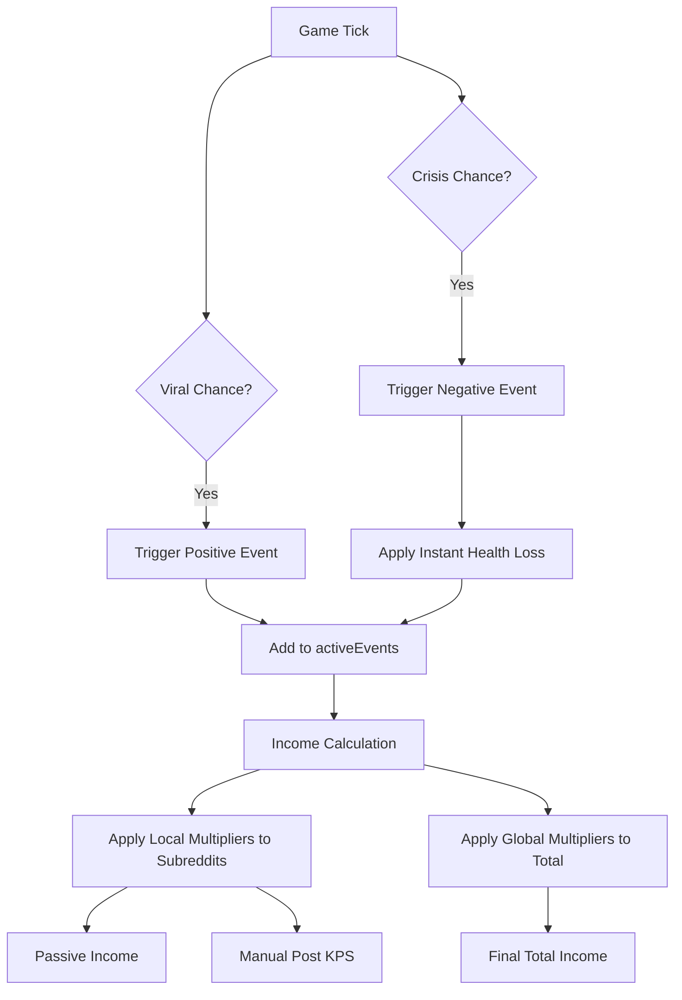

# Plan: Negative Events (Crises) [COMPLETED]

Implement "opposite" events to viral content that crash KPS and affect subreddit health.

## 1. Data Structure Updates
- Update `ViralEvent` interface in `src/store/useGameStore.ts`:
  - `isNegative: boolean`
  - `description?: string`
  - `type: 'local' | 'global'`
  - `healthLoss?: number` (instant hit)

## 2. Negative Event Variants
| Name | Description | Multiplier | Duration | Type | Health Loss |
|------|-------------|------------|----------|------|-------------|
| Subreddit Drama | Users are arguing in the comments. | 0.5x | 45s | Local | 0 |
| Mod Abuse | A moderator went on a power trip. | 0.2x | 20s | Local | 40 |
| Brigaded! | A rival community is downvoting everything! | 0.1x | 30s | Local | 0 |
| Algorithm Suppression | The algorithm has suppressed your reach. | 0.5x | 60s | Global | 0 |
| Server Outage | Reddit's servers are struggling. | 0.05x | 15s | Global | 0 |

## 3. Logic Implementation
- **Trigger**: Add `CRISIS_CHANCE = 0.005` to `tick`.
- **Passive Income**: Update `tick` to apply local event multipliers to each subreddit's passive income.
- **Manual Posts**: Update `addKarma` to apply local event multipliers to manual post KPS.
- **Instant Effects**: Apply `healthLoss` immediately when a negative event is triggered.

## 4. UI Updates
- **ViralEventPopup.tsx**:
  - Use `AlertTriangle` or `Flame` icons for negative events.
  - Use red/rose color scheme for negative events.
  - Display description if available.
  - Change title to "Crisis!" or "Warning!".

## 5. Mermaid Diagram

