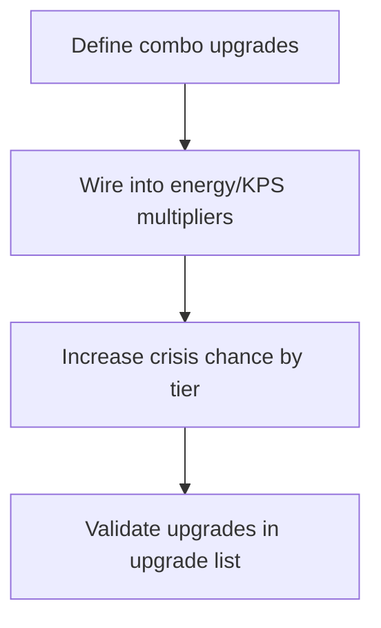

# Tier Combo Boost Plan

## Background
The goal is to introduce **tier-specific combo upgrades** that stack both energy recharge accelerations and KPS boosts while also making crisis frequency naturally increase with each tier. The new upgrades should follow the requested multipliers (2x/3x/5x/8x/13x for energy recharge and 10%/20%/50%/70%/100%/200% for KPS) and still work within the existing upgrade lifecycle described in [`src/store/useGameStore.ts:166-760`](src/store/useGameStore.ts:166-760).

## Planned Work
1. **Define combo upgrades per tier** – Expand the initial upgrade table in [`src/store/useGameStore.ts:166-216`](src/store/useGameStore.ts:166-216) with new passive upgrades that explicitly combine an energy recharge multiplier with a KPS multiplier for tiers 1 through 5. Each upgrade will include a duration so it behaves like the existing temporary boosts, and tiers will follow the requested multipliers (e.g., Tier 2 combo might be 3x energy plus 20% KPS, Tier 5 might be 13x energy plus 200% KPS).
2. **Ensure the new upgrades participate in energy/KPS calculations** – Update the multiplier tracking in [`src/store/useGameStore.ts:218-760`](src/store/useGameStore.ts:218-760) so the energy recharge multiplier set and passive income multiplier include the new combo upgrades when purchased. This keeps the existing mechanics (duration countdown, multiplier stacking) intact while amplifying their effect.
3. **Add automatic crisis scaling by tier** – Modify the event loop logic in [`src/store/useGameStore.ts:607-694`](src/store/useGameStore.ts:607-694) so the crisis spawn chance increases with the current tier (e.g., multiplying the base `CRISIS_CHANCE` by a tier factor). Optionally, tie viral event frequency or strength to tier progression if it makes sense, but the core change is higher crisis frequency as tiers ascend.
4. **Document and validate** – After wiring the combo upgrades and crisis scaling, ensure the UI sees the new upgrades via [`src/components/UpgradesList.tsx:38-97`](src/components/UpgradesList.tsx:38-97), keeping purchase costs and energy requirements balanced with per-tier escalation. Perform mental validation of the new multipliers to avoid runaway stacking.

## Workflow Diagram

