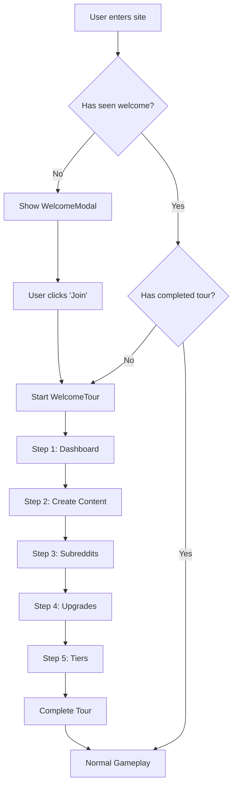

# Welcome Tour Plan

This document outlines the plan for implementing a guided step-by-step welcome tour for Karma Tycoon.

## Overview
The tour will guide new players through the core mechanics of the game using a "spotlight" effect that highlights specific UI elements and provides explanatory text.

## Tour Steps

1.  **The Dashboard (Karma & KPS)**
    - **Target**: `[data-tour="dashboard"]`
    - **Content**: "Welcome to your Dashboard! This is where you track your **Total Karma** and **Karma Per Second (KPS)**. KPS is your passive income—the higher it is, the faster you grow!"
2.  **Creating Content**
    - **Target**: `[data-tour="create-content"]`
    - **Content**: "Need a boost? Click **Create Content** to start a post. Posts provide a temporary surge in KPS as they go through their lifecycle. Watch out for your **Post Slots** limit!"
3.  **Viral Events**
    - **Target**: `[data-tour="viral-events"]`
    - **Content**: "Keep an eye out for **Viral Events**! These random occurrences can massively boost your KPS for a short time. But beware—negative events like 'Mod Abuse' can also happen!"
4.  **Subreddits**
    - **Target**: `[data-tour="subreddits"]`
    - **Content**: "Subreddits are your main source of passive income. Unlock new ones and level them up to increase your base KPS. Keep an eye on **Community Health** and **Algorithm Fatigue**!"
4.  **Global Upgrades**
    - **Target**: `[data-tour="upgrades"]`
    - **Content**: "Invest your Karma in **Global Upgrades** to permanently boost your efficiency. Some upgrades increase click power, while others multiply your passive income or viral event frequency."
5.  **Tiers & Progression**
    - **Target**: `[data-tour="tier-info"]`
    - **Content**: "Your goal is to reach the **Front Page**. Accumulate Lifetime Karma to advance through Tiers, unlocking more post slots, better energy recharge rates, and massive multipliers."

## Technical Implementation

### 1. State Management (`useGameStore.ts`)
Add the following to the `GameState`:
- `hasCompletedTour: boolean` (persisted)
- `isTourActive: boolean`
- `currentTourStep: number`

Add the following to `GameActions`:
- `startTour: () => void`
- `nextTourStep: () => void`
- `prevTourStep: () => void`
- `completeTour: () => void`
- `skipTour: () => void`

### 2. UI Components
- **`WelcomeTour.tsx`**:
    - Uses `framer-motion` for the overlay and spotlight.
    - Calculates the position of the target element using `getBoundingClientRect()`.
    - Displays a floating card with the step description and navigation buttons.
- **`TourSpotlight.tsx`**: A sub-component for the visual highlight effect.

### 3. Integration
- Add `data-tour` attributes to:
    - `Dashboard.tsx`: `Card` (dashboard), `Button` (create-content), `Button` (tier-info).
    - `ViralEventPopup.tsx`: The main `motion.div` container.
    - `SubredditList.tsx`: The container or first card.
    - `UpgradesList.tsx`: The container or first card.
- Update `WelcomeModal.tsx` to trigger `startTour()` upon completion if `hasCompletedTour` is false.

## Mermaid Diagram

